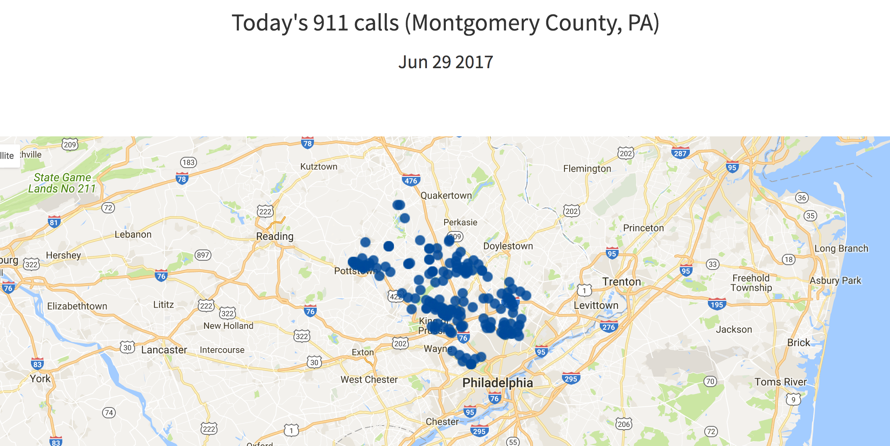

# [911 Forecast](http://www.911forecast.site)
During my Insight Data Science project I developed an application to improve emergency response by forecasting 911 calls. In particular I focused on medical emergency and used a dataset of 911 calls streamed in real-time from Montogmery Country, PA (http://montcoalert.org/gettingdata/)).

The web app was developped in Flask. The time-series model was developped in python by using sklearn toolkit and included in  insightmodel.py

